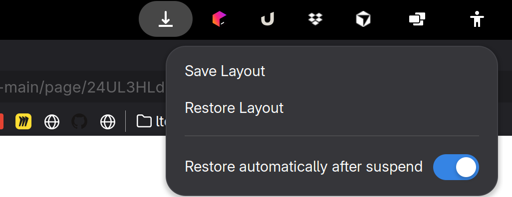

# Save My Windows

This is a GNOME extension that works well on Wayland and helps with multi-monitor, multi-workspace setups, since window
positions get messed up after each suspend.



Save My Windows periodically records all open windows along with their monitors and workspaces.
It lets you restore your window layout whenever Wayland resets or scrambles positions (e.g. after suspend).

## Installation

### Option 1: Gnome Extensions Website (Recommended)

- Go to and install from: https://extensions.gnome.org/extension/8589/save-my-windows/

### Option 2. Manually (good for development)

   ```bash
   ./install.sh
   ```

# Dev notes

### Release to Gnome Extension

- Bump version in metadata.json
- Call ./pack.sh
- Login on  https://extensions.gnome.org/extension/8589/save-my-windows/
-
-

## License

This extension is released under the GNU Public License version 3.


